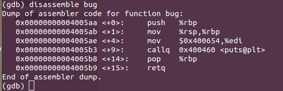
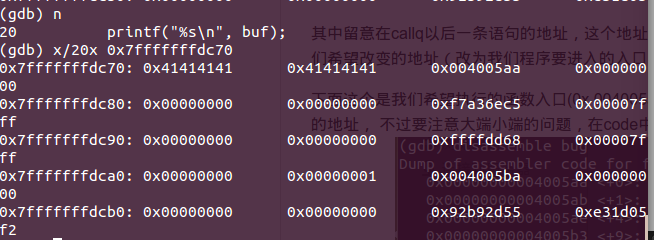

#### 以下纯粹是作为个人兴趣做的小实验

#### ll.c
```
$ gcc -g ll.c -fno-stack-protector
$ ./a.out
```


##### 实验过程：
利用gdb调试
```
    $ gdb a.out
```


查看main函数汇编以后的代码


其中留意在callq以后一条语句的地址（004005c8），这个地址将会出现在后面函数的返回地址中，
也是我们希望改变的地址（改为我们程序要进入的入口）

下面这个是我们希望执行的函数入口(0x 004005aa),这个也是我们在代码中code里面最后一行的地址，
不过要注意大端小端的问题，在code中会从右往左以一个byte（两个数字）的形式放入内存中



进入到copy函数中执行，在复制strcpy之前查看一下目前的内存情况


buf的起始地址是0x7fffffffdc60,esp(指向栈顶)的地址是0xffffdc50，ebp（局部变量的栈底）的地址是0xffffdc70。
（记住：我们的栈是从高地址向低地址扩展的），而返回的地址就在ebp存储的地址的“上面”

我们查看一下ebp附近的内存情况


我们看到了004005c8，这里就表明这里放的就是返回地址，我们现在就是想通过栈溢出，修改这个地方的值为我们的目标地址。

现在我们就执行下一条命令，将code的字符串复制上去，修改成我们要的地址



成功修改好了（这个需要之前在code里面放好我们要的地址）

继续执行


成功，之后的段错误就不需要管了，因为我们想要运行的程序在此时已经运行完毕了：p

（明明应该在认真复习的我到底现在在干什么ORZ）


